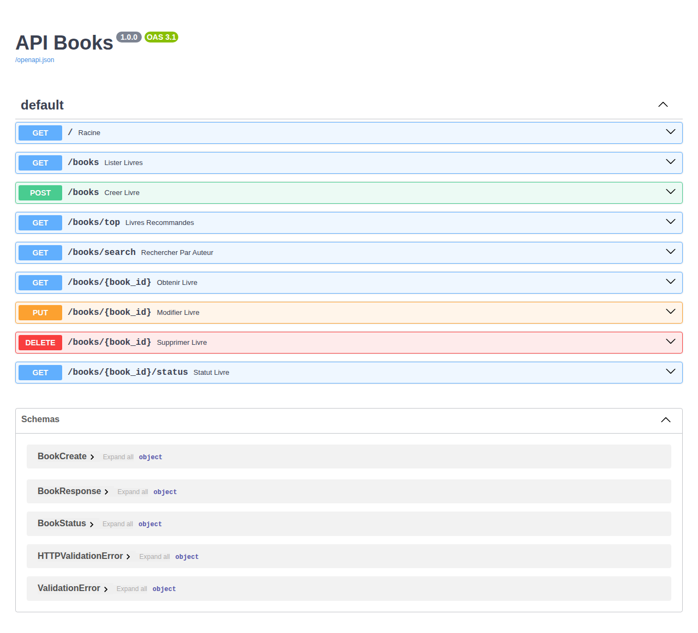

# Partie 3 — API REST de gestion de livres (FastAPI)

API REST permettant de gérer une collection de livres, avec **FastAPI**, **Pydantic**, **SQLAlchemy** et **SQLite**.

---

## 🟢 Marche à suivre pas-à-pas (VS Code)

> Toutes les commandes se lancent dans le **terminal intégré de VS Code**
> (menu **Terminal > Nouveau terminal**). Copiez-collez-les une par une.

### Étape 1 — Créer l'environnement virtuel (une seule fois)

Depuis la **racine** `rendu_louzza_zehair` (un seul `.venv` sert pour tout le rendu) :

```powershell
python -m venv .venv
```

> Déjà fait via `setup.bat` ou pour la Partie 2 ? Passez à l'étape 2.

### Étape 2 — Activer l'environnement virtuel

**Windows (PowerShell)**
```powershell
.venv\Scripts\Activate.ps1
```

**macOS / Linux**
```bash
source .venv/bin/activate
```

Après activation, la ligne du terminal commence par `(.venv)`.

> Si PowerShell bloque (« exécution de scripts désactivée »), lancez une fois :
> ```powershell
> Set-ExecutionPolicy -Scope CurrentUser RemoteSigned
> ```

### Étape 3 — Se placer dans le dossier de l'API

```powershell
cd Partie_03\api_livres
```

> Sur macOS / Linux : `cd Partie_03/api_livres`

### Étape 4 — Installer les dépendances

```powershell
pip install -r requirements.txt
```

Cela installe FastAPI, Uvicorn, SQLAlchemy, Pydantic, httpx et pytest.

### Étape 5 — Lancer les tests

```powershell
pytest
```

✅ Résultat attendu :
```
21 passed, 1 skipped
```

### Étape 6 — Démarrer le serveur API

```powershell
uvicorn src.main:app --reload
```

> Si `uvicorn` n'est pas reconnu :
> ```powershell
> python -m uvicorn src.main:app --reload
> ```

### Étape 7 — Ouvrir l'API dans le navigateur

- API : http://127.0.0.1:8000
- Documentation interactive (Swagger) : http://127.0.0.1:8000/docs

Depuis la page `/docs`, vous pouvez tester chaque route directement (bouton **Try it out**).

Voici à quoi ressemble la documentation interactive générée automatiquement par FastAPI :



Pour **arrêter le serveur** : `Ctrl+C` dans le terminal.

---

## 🎬 Démo animée

La démo ci-dessous montre l'API en action depuis la page `/docs` :
création d'un livre via `POST /books` (bouton **Try it out** → saisie du JSON → **Execute** → réponse **201**), puis affichage de la liste via `GET /books`.


---

## À copier-coller d'un seul bloc (Windows)

Depuis la racine `rendu_louzza_zehair` :

```powershell
python -m venv .venv
.venv\Scripts\Activate.ps1
cd Partie_03\api_livres
pip install -r requirements.txt
pytest
uvicorn src.main:app --reload
```

---

## Tester l'API en ligne de commande (exemples)

Une fois le serveur lancé, dans un **second** terminal :

```powershell
# Créer un livre
curl -X POST http://127.0.0.1:8000/books -H "Content-Type: application/json" -d "{\"title\":\"Clean Code\",\"author\":\"Robert C. Martin\",\"year\":2008,\"rating\":5}"

# Lister les livres
curl http://127.0.0.1:8000/books

# Consulter le statut métier du livre 1
curl http://127.0.0.1:8000/books/1/status
```

---

## Structure

```
api_livres/
├── README.md
├── requirements.txt
├── pyproject.toml         # config pytest (pythonpath : rend `src` importable)
├── docs/                  # capture d'écran + démo animée
├── src/
│   ├── __init__.py
│   ├── main.py            # instanciation FastAPI + création des tables
│   ├── database.py        # engine, session, Base, dépendance get_db
│   ├── models.py          # modèle SQLAlchemy Book (table books)
│   ├── schemas.py         # schemas Pydantic (validation / sérialisation)
│   ├── services.py        # logique métier + accès base (CRUD, compute_status)
│   └── routes.py          # endpoints HTTP
└── tests/
    └── test_books.py
```

## Endpoints

| Méthode | Endpoint | Comportement |
|---------|----------|--------------|
| GET | `/` | `{"message": "API Books OK"}` |
| POST | `/books` | crée un livre, retourne le livre (201) |
| GET | `/books` | liste des livres |
| GET | `/books/{id}` | un livre ou 404 |
| PUT | `/books/{id}` | modifie un livre ou 404 |
| DELETE | `/books/{id}` | supprime un livre ou 404 |
| GET | `/books/{id}/status` | statut métier du livre |
| GET | `/books/top` | *(bonus)* livres avec note >= 4 |
| GET | `/books/search?q=...` | *(bonus)* recherche par titre **ou** auteur (`author=...` accepté aussi) |

## Règle métier `compute_status`

- `rating >= 4` → `"recommended"`
- `rating >= 2` → `"average"`
- `rating < 2` → `"bad"`

## Choix techniques

- **Séparation en couches** : `routes` (HTTP) → `services` (métier + DB) → `models` (ORM) / `schemas` (validation). Les routes ne contiennent aucune règle métier.
- **Validation Pydantic** avec `Field` : `title`/`author` ≥ 2 caractères, `year` ≥ 1900, `rating` entre 0 et 5. Une donnée invalide renvoie automatiquement une erreur 422.
- **`get_db`** en dépendance FastAPI : ouvre une session par requête et la ferme proprement (pas de fuite de connexion).
- **Ordre des routes** : `/books/top` et `/books/search` sont déclarées avant `/books/{book_id}` pour éviter que « top »/« search » soient pris pour un identifiant.
- **DELETE** renvoie 204 (No Content) car il n'y a pas de corps à retourner.

## Dépannage

| Erreur | Solution |
|--------|----------|
| `No module named 'fastapi'` / `'sqlalchemy'` / `'pydantic'` | Activez le venv puis `pip install -r requirements.txt` |
| `No module named 'src.database'` | Lancez `pytest` depuis `Partie_03\api_livres` |
| `Could not import module "src.main"` | Placez-vous dans `Partie_03\api_livres` avant `uvicorn` |
| `uvicorn n'est pas reconnu` | Utilisez `python -m uvicorn src.main:app --reload` |
| Le port 8000 est occupé | `uvicorn src.main:app --reload --port 8001` |

## Note de régression (Partie 4.2)

Si `compute_status` était modifiée pour tester `rating > 4` au lieu de `rating >= 4`, un livre noté 4 basculerait à tort de `"recommended"` vers `"average"`. Le test paramétré `test_compute_status[4-recommended]` échouerait alors immédiatement en affichant `average != recommended`. Ce test verrouille donc les seuils métier et détecte toute régression sur les bornes de notation.

## Limites connues

- La base `books.db` est un fichier local recréé au premier lancement ; aucune migration n'est gérée (SQLAlchemy `create_all`).
- Pas d'authentification : l'API est ouverte, adaptée à un contexte d'examen local.
