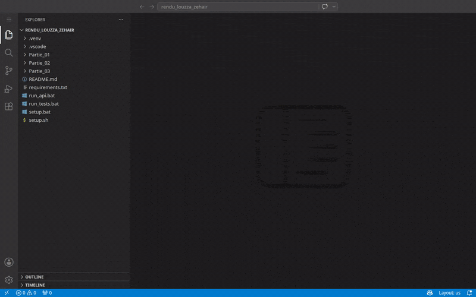

# Examen final — Programmation avec Python

[](https://github.com/zehair-louzza/banque/actions/workflows/tests.yml)

MBA Big Data & Intelligence Artificielle — M2 · UE05.B · 2025-2026

> Le badge ci-dessus affiche automatiquement le résultat des tests (31 tests : Partie 2 + Partie 3), relancés par GitHub Actions à chaque push. Vert = tous les tests passent.

---

## 🚀 Démarrage rapide (recommandé)

Des scripts automatiques créent le venv, installent les dépendances et lancent tout. Ouvrez un terminal dans le dossier `rendu_louzza_zehair` puis :

**Windows** (double-cliquez sur le fichier, ou dans le terminal) :
```powershell
.\setup.bat        REM 1. installe tout (a faire une seule fois)
.\run_tests.bat    REM 2. lance tous les tests
.\run_api.bat      REM 3. demarre l'API livres
```

**macOS / Linux** :
```bash
bash setup.sh                                             # 1. installe tout (une seule fois)
source .venv/bin/activate && cd Partie_02/module_bancaire && pytest && cd ../..   # tests P2
source .venv/bin/activate && cd Partie_03/api_livres && pytest                    # tests P3
cd Partie_03/api_livres && uvicorn src.main:app --reload                          # API
```

**Depuis VS Code** (sans terminal) : `Ctrl+Shift+P` → **Run Task** → choisissez
« 1. Installer », puis « 2. Lancer tous les tests » ou « 3. Demarrer l'API livres ».

🎬 Démonstration du flux complet (palette de commandes → choix de la tâche → tests verts) :



> Résultats attendus : **10 passed, 1 skipped** (Partie 2) et **21 passed, 1 skipped** (Partie 3).
> API accessible sur http://127.0.0.1:8000/docs

La suite du document explique la méthode **manuelle** pas-à-pas et le dépannage.

---

## ⚠️ Les 3 erreurs à éviter

Si vous avez des erreurs `ModuleNotFoundError` ou `attempted relative import`, c'est presque toujours l'une de ces 3 causes :

1. **NE cliquez PAS sur le bouton ▶️ « Run » de VS Code** pour lancer un fichier comme `compte.py`, `test_books.py`, `database.py`, etc.
   Ces fichiers font partie d'un projet : ils **ne s'exécutent pas seuls**. Il faut passer par `pytest` (pour les tests) ou par `uvicorn` / `python -m src.main` (voir plus bas).
   → C'est ce qui provoque `attempted relative import with no known parent package` et les erreurs sur `test_books.py`.

2. **Installez les dépendances** (`pytest`, `fastapi`, `uvicorn`, `sqlalchemy`, `pydantic`).
   → Sans ça : `ModuleNotFoundError: No module named 'pytest'` (ou `fastapi`, `sqlalchemy`...).

3. **Placez-vous dans le BON dossier** avant de lancer une commande.
   → Lancer `pytest` depuis `rendu_louzza_zehair/` (la racine) donne `No module named 'src'`.
   → Il faut être **dans le dossier de la partie** : `Partie_02/module_bancaire/` ou `Partie_03/api_livres/`.

> Vous avez aussi **deux versions de Python installées** (3.13 et 3.14). Pour éviter tout mélange, on crée un environnement virtuel ci-dessous : tout s'installe et se lance au même endroit.

---

## Sommaire

- [Prérequis](#prérequis)
- [Étape 1 — Ouvrir le projet dans VS Code](#étape-1--ouvrir-le-projet-dans-vs-code)
- [Étape 2 — Créer et activer l'environnement virtuel](#étape-2--créer-et-activer-lenvironnement-virtuel)
- [Étape 3 — Choisir le bon interpréteur dans VS Code](#étape-3--choisir-le-bon-interpréteur-dans-vs-code)
- [Étape 4 — Lancer la Partie 2 (module bancaire)](#étape-4--lancer-la-partie-2-module-bancaire)
- [Étape 5 — Lancer la Partie 3 (API livres)](#étape-5--lancer-la-partie-3-api-livres)
- [Tableau de dépannage](#tableau-de-dépannage)
- [Structure du projet](#structure-du-projet)

---

## Prérequis

Un terminal PowerShell (celui intégré à VS Code convient). Vérifiez que Python répond :

```powershell
python --version
```

Vous devez voir `Python 3.13.x` ou `3.14.x`. Si `python` n'est pas reconnu, essayez `py --version`.

---

## Étape 1 — Ouvrir le projet dans VS Code

1. Dans VS Code : **Fichier > Ouvrir le dossier** → sélectionnez le dossier **`rendu_louzza_zehair`** (celui décompressé dans `Downloads`).
2. Ouvrez un terminal : menu **Terminal > Nouveau terminal**.
3. Le terminal doit afficher :
   ```
   PS C:\Users\Zeh\Downloads\rendu_louzza_zehair>
   ```

---

## Étape 2 — Créer et activer l'environnement virtuel

Depuis la racine `rendu_louzza_zehair` (là où vous êtes à l'étape 1) :

```powershell
python -m venv .venv
.venv\Scripts\Activate.ps1
```

Après activation, la ligne du terminal commence par **`(.venv)`** :

```
(.venv) PS C:\Users\Zeh\Downloads\rendu_louzza_zehair>
```

> **Si PowerShell bloque avec « exécution de scripts désactivée »**, lancez une seule fois :
> ```powershell
> Set-ExecutionPolicy -Scope CurrentUser RemoteSigned
> ```
> Répondez `O` (Oui), puis relancez `.venv\Scripts\Activate.ps1`.

Ensuite, mettez pip à jour (recommandé) :

```powershell
python -m pip install --upgrade pip
```

---

## Étape 3 — Choisir le bon interpréteur dans VS Code

Un fichier **`.vscode/settings.json`** est déjà fourni : il sélectionne automatiquement l'interpréteur du `.venv`, active pytest et l'activation auto du terminal. Il suffit donc, après avoir créé le venv (étape 2), de **fermer puis rouvrir VS Code** : l'interpréteur `.venv` sera pris en compte tout seul.

Si jamais l'interpréteur n'est pas détecté, faites-le manuellement :

1. `Ctrl+Shift+P` → tapez **Python: Select Interpreter**.
2. Choisissez celui qui contient **`.venv`** (affiché `('.venv')`).
3. Fermez et rouvrez le terminal pour qu'il reprenne le venv (`(.venv)` visible).

> **macOS / Linux** : le fichier fourni pointe vers `.venv/Scripts/python.exe` (Windows). Sur Mac/Linux, remplacez cette ligne dans `.vscode/settings.json` par :
> ```json
> "python.defaultInterpreterPath": "${workspaceFolder}/.venv/bin/python",
> ```

---

## Étape 4 — Lancer la Partie 2 (module bancaire)

```powershell
# 1. Aller dans le dossier de la partie
cd Partie_02\module_bancaire

# 2. Installer pytest
pip install pytest

# 3. Lancer les tests (surtout PAS le bouton Run)
pytest
```

✅ Résultat attendu : **`10 passed, 1 skipped`**

Pour l'application interactive (menu dépôt / retrait), toujours depuis `Partie_02\module_bancaire` :

```powershell
python -m src.main
```

> ⚠️ N'écrivez jamais `python src\compte.py` ni `python src\main.py`. Utilisez la forme `python -m src.main` (avec un point, sans `.py`).

Pour revenir à la racine ensuite :
```powershell
cd ..\..
```

---

## Étape 5 — Lancer la Partie 3 (API livres)

```powershell
# 1. Aller dans le dossier de l'API
cd Partie_03\api_livres

# 2. Installer TOUTES les dépendances
pip install -r requirements.txt

# 3. Lancer les tests
pytest

# 4. Démarrer le serveur API
uvicorn src.main:app --reload
```

✅ Résultat attendu des tests : **`21 passed, 1 skipped`**

> Si `uvicorn` n'est pas reconnu, utilisez : `python -m uvicorn src.main:app --reload`

Une fois le serveur lancé, ouvrez dans le navigateur :

- API : http://127.0.0.1:8000
- Documentation interactive (Swagger) : http://127.0.0.1:8000/docs

Pour **arrêter le serveur** : `Ctrl+C` dans le terminal.

---

## Tableau de dépannage

| Message d'erreur | Cause réelle | Solution |
|------------------|--------------|----------|
| `No module named 'pytest'` | pytest pas installé (ou venv non activé) | Activez le venv (étape 2), puis `pip install pytest` |
| `No module named 'fastapi'` / `'sqlalchemy'` / `'pydantic'` | Dépendances non installées | Dans `Partie_03\api_livres` : `pip install -r requirements.txt` |
| `attempted relative import with no known parent package` | Vous avez cliqué **Run** sur `compte.py` (ou lancé `python src\compte.py`) | Ne lancez pas les fichiers seuls. Utilisez `pytest` ou `python -m src.main` |
| `No module named 'src'` en lançant `pytest` | pytest lancé depuis la racine `rendu_louzza_zehair` | Placez-vous dans `Partie_02\module_bancaire` ou `Partie_03\api_livres` avant `pytest` |
| `No module named 'src.database'` | Idem : mauvais dossier | Faites `cd Partie_03\api_livres` puis `pytest` |
| `Could not import module "src.main"` (uvicorn) | Pas dans `Partie_03\api_livres` | `cd Partie_03\api_livres` avant `uvicorn` |
| `uvicorn n'est pas reconnu` | uvicorn pas dans le PATH | Utilisez `python -m uvicorn src.main:app --reload` |
| `Activate.ps1 ... exécution de scripts désactivée` | Politique PowerShell | `Set-ExecutionPolicy -Scope CurrentUser RemoteSigned` puis réactivez |
| VS Code souligne les imports en rouge/jaune | Mauvais interpréteur | Étape 3 : sélectionnez l'interpréteur `.venv` |
| Le port 8000 est déjà utilisé | Un serveur tourne déjà | `uvicorn src.main:app --reload --port 8001` |

> **Règle d'or** : `(.venv)` visible **+** bon dossier de la partie **+** dépendances installées **+** on lance par `pytest` / `uvicorn` / `python -m src.main` (jamais le bouton Run). 95 % des erreurs viennent de là.

---

## Récapitulatif express (copier-coller)

```powershell
# Depuis la racine rendu_louzza_zehair, une seule fois :
python -m venv .venv
.venv\Scripts\Activate.ps1
python -m pip install --upgrade pip

# Partie 2
cd Partie_02\module_bancaire
pip install pytest
pytest
cd ..\..

# Partie 3
cd Partie_03\api_livres
pip install -r requirements.txt
pytest
uvicorn src.main:app --reload
```

---

## Structure du projet

```
rendu_louzza_zehair/
├── README.md                         # ce fichier
├── Partie_01/
│   └── reponses_partie_1.md          # Questions de cours
├── Partie_02/
│   └── module_bancaire/              # POO, règles métier, exceptions
│       ├── README.md
│       ├── pyproject.toml            # config pytest (pythonpath)
│       ├── src/  (compte.py, exceptions.py, main.py, __init__.py)
│       └── tests/ (test_compte.py)
└── Partie_03/
    └── api_livres/                   # API REST FastAPI + SQLite + SQLAlchemy
        ├── README.md
        ├── requirements.txt
        ├── pyproject.toml            # config pytest (pythonpath)
        ├── docs/                     # capture d'écran + démo animée
        ├── src/  (main, database, models, schemas, services, routes)
        └── tests/ (test_books.py)
```

Chaque partie technique contient son propre `README.md` détaillant les choix techniques, la note de régression et les limites.
